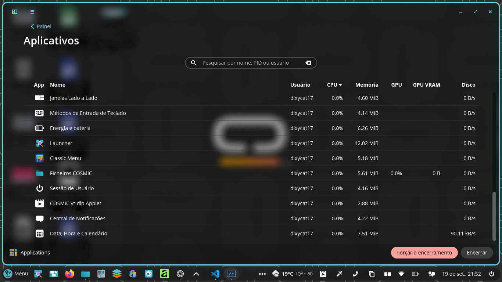

  <b>Screenshots do Applet</b>

  

  
  

    Foi compilado no Celeron N4500 de apenas dois core!
  

---

  
  

    Mascote do Projeto
  

---

## 🎬 Demonstração em Vídeo atualizado 19/09/2026
https://github.com/user-attachments/assets/900f3e96-1963-4bee-b4c5-f9aeab04a5c6

## 🎬 Demonstração em Vídeo antigo
https://github.com/user-attachments/assets/da029620-f371-4066-82e6-560856221e34

## 🎬 Demonstração em Vídeo mais antigo
https://github.com/user-attachments/assets/4f8fcd20-2e21-41de-acb6-3fadca34432e
